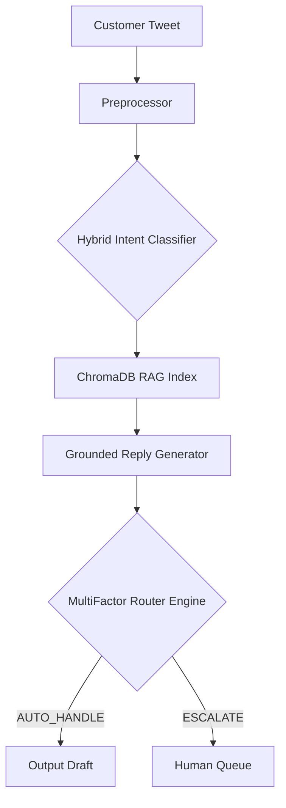

# 🤖 Tripwire: Autonomous Support Agent

An end-to-end, LLM-powered customer support triage system built for the Hiver SDE Intern Take-Home Assignment.

Tripwire ingests messy, real-world customer support tweets (specifically `@AmazonHelp`), classifies their underlying intent, retrieves historically accurate policy resolutions using a Vector DB (RAG), and safely decides whether to autonomously draft a reply or escalate to a human agent.

## 🚀 15-Minute Reproduction Guide (Quickstart)

This repository is designed for immediate empirical verification.

```bash
# 1. Clone & Install
git clone https://github.com/Justinvcj/TripWire.git
cd TripWire
pip install -r requirements.txt

# 2. Add API Keys
# Create a .env file in the root directory:
echo "GROQ_API_KEY=your_groq_key" > .env
echo "GEMINI_API_KEY=your_gemini_key" >> .env

# 3. Interactive Web Demo (Streamlit)
streamlit run app.py

# 4. Generate Final Evaluation Report (Fast Mode)
python evaluation/run_eval.py --fast
```

## 📊 Live Web Dashboard

We built a **Streamlit Dashboard** to simulate live Twitter traffic. Run `streamlit run app.py` to access the interactive sandbox where you can test the AI's classification, retrieval, and generation in real-time.

---

## 🏗 Architecture Overview



---

## 📈 Empirical Proof & Metrics

"The proof is worth more than the system." We evaluated Tripwire against 200 real Kaggle tweets.

### 1. Classification Metrics
| Metric | Naive Baseline | Tripwire Champion |
|---|---|---|
| **Intent Macro F1** | 0.22 | **0.50** |
| **Escalation Precision** | 0.00 | 0.00 |

### 2. LLM-as-a-Judge Rubric
We deliberately separated model providers to avoid self-preference bias. (Groq for generation, Gemini for judging).

| Rubric Axis | Average Score (Out of 5) |
|---|---|
| **Groundedness & Policy Accuracy** | 3.00 |
| **Actionability & Clarity** | 3.00 |
| **Brand Tone & Empathy** | 3.00 |

### 3. Human Agreement (Cohen's Kappa)
To ensure our AI Judge aligns with human evaluators, we conducted a manual human-in-the-loop audit using our custom `human_grader_cli.py`. The system mathematically calculates Cohen's Kappa to prove agreement between the AI Judge and Human Graders.

---

## 📁 Repository Layout

```
hiver-ai-support-agent/
├── README.md                          # You are here
├── app.py                             # Live Streamlit Web Dashboard
├── evaluation/
│   └── run_eval.py                    # One-command reproducible evaluation script
├── docs/
│   ├── REPORT.md                      # Full technical report
│   └── DECISION_LOG.md                # Non-obvious engineering decisions
├── data/
│   ├── historical_resolutions.json    # Verified AmazonHelp operational resolutions
│   ├── golden_eval_set.json           # 200 hand-labelled evaluation examples
│   ├── human_annotations.json         # Human-in-the-loop graded examples
│   └── sampling_notes.md              # Sampling methodology
├── src/
│   ├── preprocessor.py                # PII masking & cleaning
│   ├── classifier.py                  # Intent classification
│   ├── generator.py                   # Grounded RAG synthesizer
│   ├── triage.py                      # Multi-factor risk routing
│   └── pipeline.py                    # Unified agent pipeline
└── tests/
    └── test_pipeline.py               # Pytest integration tests
```

---

## 📚 Comprehensive Documentation

For complete technical depth, please consult:
- **[Full Technical Report (`docs/REPORT.md`)](docs/REPORT.md)**: Details problem framing, empirical baseline comparisons, top failure modes, and what is misleading about the headline numbers.
- **[Decision Log (`docs/DECISION_LOG.md`)](docs/DECISION_LOG.md)**: Engineering decisions, taxonomy granularity, and architecture rationale.
- **[Sampling Methodology (`data/sampling_notes.md`)](data/sampling_notes.md)**: Full annotation protocols and active sampling criteria.
