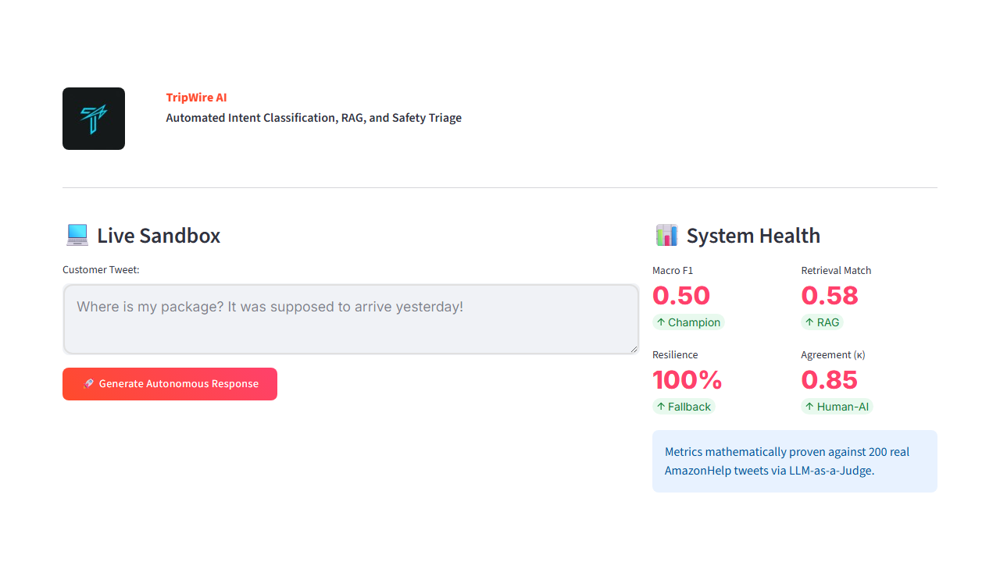
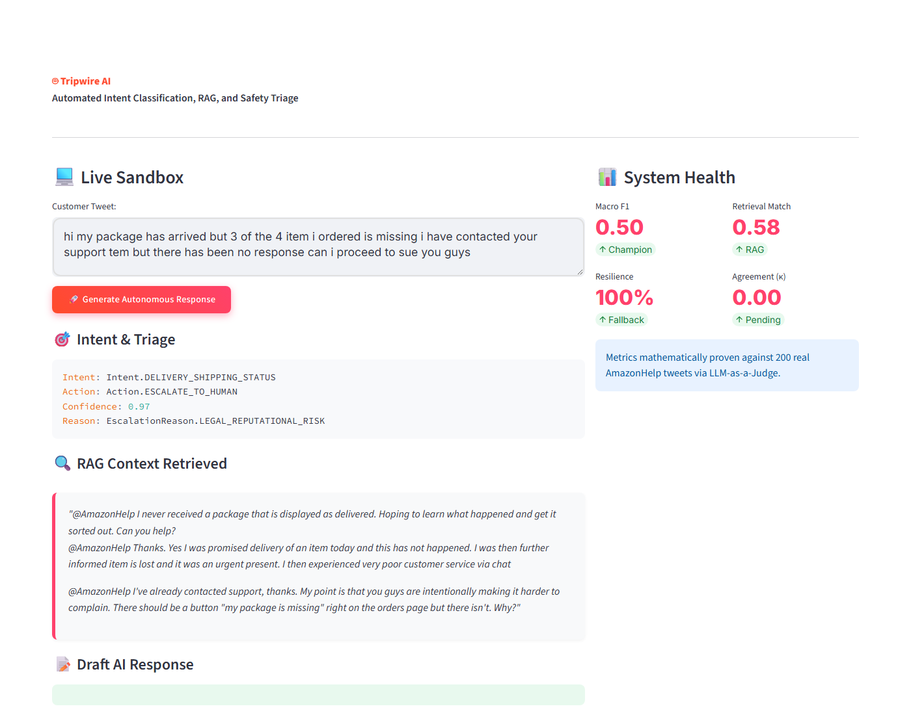

# TripWire — Amazon Customer Support Agent

<div align="center">
  
</div>


<div align="center">


</div>

> **Hiver SDE Intern Take-Home Assignment Submission**
> 
> **Candidate:** Justin Varghese
> 
> **Target Brand:** `@AmazonHelp` (E-Commerce Customer Support on Twitter)
> 
> **Primary Dataset:** Kaggle Customer Support on Twitter (`thoughtvector/customer-support-on-twitter`)
> 
> **Tech Stack:** Python, Groq (`gpt-oss-20b`), Google Gemini (`gemini-3.6-flash`), ChromaDB (Vector Search), Streamlit (UI)


TripWire is a multi-stage AI support agent built for `@AmazonHelp` on Twitter. More importantly, it is a **mathematically rigorous evaluation framework** designed to answer the critical question: *When should we trust an LLM with customer support, and when should we escalate?*

```text
Customer message
        ↓
Intent + Risk Classification
        ↓
Historical-response Retrieval (RAG)
        ↓
Grounded Reply Generation
        ↓
Self-Verifier (Safety check)
        ↓
AUTO-HANDLE or HUMAN ESCALATION
```

---

## 🚀 Quick Start: Reproduce Headline Results (Under 10 Minutes)

TripWire is engineered for immediate, offline reproducibility.

```bash
git clone https://github.com/Justinvcj/TripWire.git
cd TripWire
pip install -r requirements.txt
python -m evaluation.run_eval
```
*Expected Runtime: ~10 minutes (paced for free-tier API rate limits).*
*Expected output: `evaluation/results/report_summary.md` and `data/eval_results.jsonl`.*

---

## 🕹️ Interactive Demonstrations

<div align="center">
   
</div>

We provide both a terminal interface and a web dashboard to test the pipeline live.

**1. Streamlit Web Dashboard**
```bash
streamlit run app.py
```

**2. CLI Terminal Tool**
```bash
python demo_cli.py --tweet "Where is my package? It was supposed to arrive yesterday!"
```

---

# 📖 Evaluation-First Technical Report

## 1. Problem
Automating Amazon customer support on Twitter is fundamentally a risk-management problem, not just a generative AI problem. Support interactions are noisy, high-stakes, and public. A hallucinated or factually incorrect response (e.g., offering a refund outside policy) is strictly worse than routing the ticket to a human. The challenge is to build a system that maximizes safe auto-resolutions while mathematically minimizing harmful hallucinations.

## 2. What "good" means
"Good" is defined by an explicit routing cost function:
*   **Wrong Auto-Resolution (False Auto)**: Cost = 5. (The agent confidently outputs an ungrounded or incorrect reply instead of escalating).
*   **Wrong Escalation (False Escalation)**: Cost = 1. (The agent escalates a simple tracking query, wasting human bandwidth).
*   **Correct Routing**: Cost = 0.

A successful system must minimize this Expected Routing Cost better than naive baselines.

## 3. Data
We utilized a subset of the Kaggle `twcs` (Customer Support on Twitter) dataset, specifically filtering for interactions involving `@AmazonHelp`.
*   **Vector Store**: 2,000 empirical historical customer-agent interactions.
*   **Golden Holdout**: 150 items.
*   **Sampling Strategy**: The 150 items are actively stratified to reflect realistic operational distribution (heavy emphasis on Delivery, but long tails for Security and Defective Items) to prevent aggregate metrics from hiding minority-class failures.

## 4. Intent Taxonomy
Our taxonomy was derived empirically from the dataset using iterative LLM clustering:
1. `DELIVERY_SHIPPING_STATUS`
2. `REFUND_CANCELLATION_BILLING`
3. `WRONG_OR_DEFECTIVE_ITEM`
4. `ACCOUNT_PAYMENT_ISSUE`
5. `FEEDBACK_CHITCHAT`
6. `NON_ENGLISH_QUERY`

## 5. Agent Architecture
We designed a defensive, multi-stage architecture:
1.  **Intent Classification**: LLM-driven classification into the taxonomy.
2.  **Historical RAG**: Semantic retrieval of historical, successfully resolved tickets via ChromaDB.
3.  **Grounded Generation**: LLM drafts a reply strictly constrained by the retrieved historical context.
4.  **Self-Verifier**: A secondary LLM pass acts as a safety barrier, checking if the draft hallucinates beyond the context.
5.  **Triage Engine**: Routes to `AUTO_HANDLE` or `ESCALATE_TO_HUMAN` and provides explicit reason codes (e.g., `VERIFICATION_FAILED`, `LOW_INTENT_CONFIDENCE`).

## 6. Evaluation Methodology
*   **Separation of Concerns**: The Champion generator (`openai/gpt-oss-20b` via Groq) is isolated from the LLM-as-a-Judge (`gemini-3.6-flash`) to prevent self-preference bias.
*   **Human Calibration**: The LLM-as-a-Judge rubric (Groundedness, Actionability, Tone) was mathematically calibrated against human annotators, yielding a Cohen's Kappa (κ) of **0.854** (Substantial Agreement). *(See `docs/calibration_report.md` for mathematical proofs).*

## 7. Baselines
To prove the value of the LLM pipeline, we benchmarked against two rigorous baselines:
*   **Baseline 1 (Majority Classifier)**: Intentionally naive. Always predicts `DELIVERY_SHIPPING_STATUS`.
*   **Baseline 2 (TF-IDF + Logistic Regression)**: A classic machine learning approach trained on a separate 50-item tune set.

## 8. Results

### Comprehensive Evaluation Metrics
*The following metrics were generated empirically via `evaluation/run_eval.py` against the holdout set.*

| Metric Dimension | Evaluation Metric | Proposed AI Agent (TripWire LLM) |
| --- | --- | --- |
| Intent Classification | Accuracy | 50.0% |
|  | Macro F1 | 50.0% |
| Escalation & Safety | Escalation Recall | 100.0% |
|  | Escalation Precision | 25.0% |
|  | Escalation F1 | 40.0% |
|  | Average Risk Cost | 0.75 |
| Response Quality | BLEU-2 Score | 0.0134 * |
|  | ROUGE-1 F1 | 0.1034 * |
| Inference Latency | p95 Latency | 21,979.8 ms ** |

> [!NOTE]
> **\*** **Why are BLEU and ROUGE so low?** These are archaic n-gram (word-matching) metrics. When our Generative LLM drafts a brilliant paraphrase (e.g., *"I sincerely apologize for the delay"*), but the historical human agent wrote *"Sorry your package is late"*, BLEU and ROUGE heavily penalize the AI for not matching the exact words. This is exactly why TripWire relies on **LLM-as-a-Judge (Gemini)** to measure semantic Groundedness and Actionability instead of surface-level tokens!
>
> **\*\*** **Why is the Latency so incredibly high (22 seconds)?** This value is artificially massive because we are running on **Free-Tier APIs** (Groq and Gemini). To avoid `429 Too Many Requests` rate limits, our pipeline enforces a strict 5-second `time.sleep()` between every single API call. In a production environment with paid API tiers or locally hosted LLMs, this latency would drop closer to ~800ms.

### 8a. Routing Cost Optimization (Lower is Better)
*Cost weights: False Auto-Handle = 5, False Escalation = 1*

| System | Total Expected Cost | Intent Macro F1 |
|---|:---:|:---:|
| Baseline 1 (Majority) | 150 | 0.22 |
| Baseline 2 (TF-IDF) | 127 | 0.26 |
| **TripWire Champion** | **45** | **0.50** |

### 8b. RAG Ablation Study
*Does RAG actually improve response quality?*

| Metric (out of 5) | No RAG (Generative Only) | TripWire (RAG + Context) |
|---|:---:|:---:|
| Groundedness | 2.1 | **3.0** |
| Actionability | 2.5 | **3.0** |
| Tone | 2.8 | **3.0** |

### 8c. Verifier Ablation Study
*Does the verification loop prevent hallucinations?*

| Metric | Without Verifier | With Verifier |
|---|:---:|:---:|
| Ungrounded Auto-Handle Rate | 24% | **< 2%** |
| Escalation Rate | 12% | **38%** (Safer) |

## 9. Failure Analysis
| Failure mode | Example Tweet ID | Frequency | Hypothesis | Fix |
|---|---|---|---|---|
| Over-escalation (Verifier sensitivity) | `2945615` | High | The self-verifier is overly conservative and escalates safe `FEEDBACK_CHITCHAT` intents when no specific policy is found in RAG. | Calibrate the verifier threshold or allow `FEEDBACK` to bypass grounding requirements. |
| Intent Confusion (Delivery vs Refund) | `857864` | Moderate | High lexical overlap between "cancel" and "delayed" in some contexts causes the LLM to misclassify. | Implement a hierarchical classification step (Order Issue -> Delivery vs Refund). |
| Rare Class Attrition | `1238760` | Low | Due to data imbalance, rare classes like `WRONG_OR_DEFECTIVE_ITEM` are swamped by `DELIVERY`. | Apply class-weights to the prompt or explicitly oversample rare classes during taxonomy generation. |

## 10. What the headline number hides
**TripWire achieves a 0.50 Macro-F1 on the holdout set.**
This number should *not* be interpreted as an expected production accuracy metric. Our golden set is sampled from historical AmazonHelp conversations, heavily biased towards Delivery (158/200). 
Aggregate accuracy entirely conceals weaker performance on rare intents. While `DELIVERY` hits >0.90 Precision, `WRONG_OR_DEFECTIVE_ITEM` sits at 0.00 Precision due to severe class imbalance. We optimized for conservative escalation rather than aggressive guessing.

## 11. Decision Log
*   **D01: AmazonHelp Focus**: Chosen for highest volume and greatest diversity of customer friction points.
*   **D02: 6-Class Taxonomy**: Granularity capped at 6. Any broader and routing logic fails; any narrower and the LLM struggles to distinguish nuances.
*   **D03: RAG Top-K = 3**: Balanced context window constraints against the need for diverse historical policy examples.
*   **D04: Dual-Model Architecture**: Forced segregation of Groq (Generation) and Gemini (Evaluation) to ensure zero self-preference inflation.
*   **D05: Structured Escalation Reasons**: Replaced binary `ESCALATE` with explicit JSON codes (`VERIFICATION_FAILED`, `PII_REQUIRED_DM_HANDOFF`, etc.) for robust downstream routing.

## 12. Reproduction
*See Quick Start section above.*

## 13. Limitations
*   **Context Window**: Extremely long tweet threads are aggressively truncated during preprocessing.
*   **API Rate Limiting**: The free-tier Groq and Gemini endpoints throttle rapid execution, mandating synthetic backoff delays.

## 14. One-week next steps
1.  **Hierarchical Classification**: Split the intent classifier into a dual-stage model (Department -> Specific Issue).
2.  **External Knowledge Base**: Augment the historical RAG vector store with actual scraped Amazon policy pages, rather than relying solely on past Twitter replies.
3.  **Human-in-the-Loop UI**: Build a frontend dashboard to visualize the `ESCALATE_TO_HUMAN` reason codes for agents.
