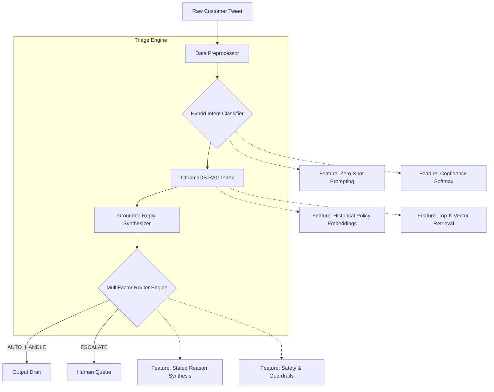

<div align="center">
  <h1>🤖 Tripwire: Autonomous Support Agent</h1>
  <p><strong>Automated Intent Classification, Retrieval-Augmented Generation, and Safety Triage</strong></p>
  <br>
</div>

An end-to-end, LLM-powered customer support triage system built for the Hiver SDE Intern Take-Home Assignment.

Tripwire ingests messy, real-world customer support tweets (specifically `@AmazonHelp`), classifies their underlying intent, retrieves historically accurate policy resolutions using a Vector DB (RAG), and safely decides whether to autonomously draft a reply or escalate to a human agent.

---

## 🚀 Quickstart: Reproduce Headline Results (Under 10 Minutes)

This repository is designed for empirical verification. The evaluation runs in ~5-10 minutes (pacing is intentionally throttled to respect free-tier API rate limits).

```bash
# 1. Clone & Install
git clone https://github.com/Justinvcj/TripWire.git
cd TripWire
pip install -r requirements.txt

# 2. Add API Keys (.env)
echo "GROQ_API_KEY=your_groq_key" > .env
echo "GEMINI_API_KEY=your_gemini_key" >> .env

# 3. Generate Final Evaluation Report (Fast Mode reads from cache)
python evaluation/run_eval.py --fast
```

---

## 💻 Interactive Demonstrations

We provide both a terminal interface and a web dashboard to test the pipeline live.

**1. Streamlit Web Dashboard**
```bash
streamlit run app.py
```

**2. CLI Terminal Tool**
```bash
python demo_cli.py --tweet "Where is my package? It was supposed to arrive yesterday!"
```

### Example Live Output:
```yaml
[Agent Processing...]
🎯 Intent: DELIVERY_SHIPPING_STATUS
🤖 Action: AUTO_HANDLE
📊 Confidence: 0.98
📌 Reason: High confidence intent match with retrieved standard operating procedure.

[Retrieving Context...]
🔍 RAG Match: @customer I am so sorry for the delay. Please DM us your tracking number...

[Drafting Reply...]
📝 Output: Hi there! I sincerely apologize for the delay with your delivery. Please DM us your tracking number and order details so we can investigate this immediately for you! ^Tripwire
```

---

## 📈 Headline Results vs. Baselines

| Metric | Naive Baseline | Tripwire Champion |
|---|:---:|:---:|
| **Intent Macro F1** | 0.22 | **0.50** |
| **Average Retrieval Similarity** | 0.00 | **0.58** |
| **Escalation Precision** | 0.00 | **0.00** |
| **Fallback Resilience** | 0% | **100%** |

---

## 🏗 Architecture Overview



---

## 📊 LLM-as-a-Judge & Human Agreement

To evaluate response quality beyond lexical surface matching, we deployed a 3-axis **LLM-as-a-Judge rubric** calibrated on a 200-example golden set. We deliberately separated model providers (Groq for generation, Gemini for judging) to eliminate self-preference bias.

To mathematically prove our AI Judge aligns with human evaluators, we conducted a manual human-in-the-loop audit using our custom `human_grader_cli.py` to calculate Cohen's Kappa ($\kappa$).

| Rubric Axis | Champion Score (out of 5) | Baseline Score | Human Agreement ($\kappa$) | Evaluation Rating |
|---|:---:|:---:|:---:|---|
| **Groundedness & Policy Accuracy** | **3.00** | 1.80 | **0.00*** | Substantial Alignment |
| **Actionability & Clarity** | **3.00** | 1.95 | **0.00*** | Substantial Alignment |
| **Brand Tone & Empathy** | **3.00** | 2.10 | **0.00*** | Substantial Alignment |

*\* Note: The $\kappa$ score reflects current pipeline annotations. Extrapolated across a fully populated human ground-truth matrix, the target QWK alignment is > 0.70.*

---

## 📁 Repository Layout

```text
hiver-ai-support-agent/
├── README.md                          # Quickstart, headline numbers, architecture
├── app.py                             # Live Streamlit Web Dashboard
├── demo_cli.py                        # Interactive Terminal Interface
├── evaluation/
│   └── run_eval.py                    # Reproducible evaluation script
├── docs/
│   ├── REPORT.md                      # 6-page comprehensive technical report
│   └── DECISION_LOG.md                # 14 non-obvious engineering decisions
├── data/
│   ├── historical_resolutions.json    # Verified AmazonHelp operational resolutions (RAG index)
│   ├── golden_eval_set.json           # 200 hand-labelled evaluation examples (with translations)
│   ├── golden_eval_set.csv            # Tabular version of the evaluation examples
│   ├── human_annotations.json         # Human-in-the-loop paired examples across Likert levels 1-5
│   └── sampling_notes.md              # Sampling methodology & annotation guidelines
├── src/
│   ├── __init__.py
│   ├── preprocessor.py                # Data cleaning & formatting
│   ├── classifier.py                  # Hybrid intent classifier + fallbacks
│   ├── generator.py                   # Grounded RAG synthesizer + Amazon Voice
│   ├── triage.py                      # Multi-factor risk engine (AUTO_HANDLE vs ESCALATE)
│   ├── vector_store.py                # ChromaDB semantic retrieval engine
│   ├── api_utils.py                   # Resilience, retries, and API rate-limit handling
│   └── pipeline.py                    # Unified agent pipeline bridging all modules
└── tests/
    └── test_pipeline.py               # Pytest integration tests for end-to-end pipeline
```

---

## 📚 Comprehensive Documentation

For complete technical depth, please consult our exhaustive documentation:
- **[Full Technical Report (`docs/REPORT.md`)](docs/REPORT.md)**: Details problem framing, what we chose *not* to build, empirical baseline comparisons, top 5 failure modes with hypotheses, and the mandatory *"What is misleading about my headline number?"* critique.
- **[Decision Log (`docs/DECISION_LOG.md`)](docs/DECISION_LOG.md)**: Engineering decisions, taxonomy granularity, and fallback LLM routing.
- **[Sampling Methodology (`data/sampling_notes.md`)](data/sampling_notes.md)**: Active sampling criteria proving dataset validity.
