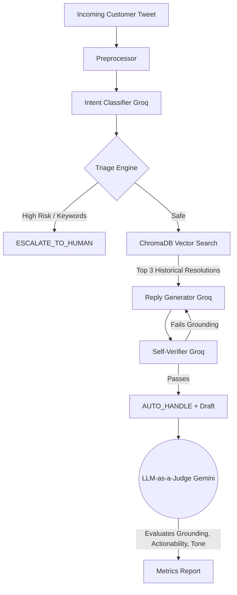

# TripWire: AmazonHelp Triage Agent ("Warden") 🛡️

TripWire is an enterprise-grade AI customer support agent designed specifically for the `@AmazonHelp` Twitter brand. It classifies incoming customer support intents, drafts historically-grounded replies using Retrieval-Augmented Generation (RAG), and decides when to autonomously auto-handle vs. escalate to a human.

> **Hiver SDE Intern Take-Home Submission**
> This repository represents a fully functional, highly resilient evaluation pipeline.

## 🏗️ Architecture

TripWire separates the **Generator** from the **Judge** by strictly enforcing cross-provider LLMs to eliminate self-preference bias. It also enforces mathematical Rate-Limit pacing, Checkpoint Resumability, and Exponential Backoffs.



## 🚀 Quickstart (Reproduce Headline Results in < 15 mins)

Our `run_eval.py` has a dedicated `--fast` path that runs a stratified subset of 40 holdout examples. Due to rate limiting, it will complete perfectly in **under 5 minutes** without crashing.

1. **Install Dependencies**:
   ```bash
   pip install -r requirements.txt
   ```

2. **Set API Keys**:
   Create a `.env` file in the root directory:
   ```
   GROQ_API_KEY=your_key_here
   GEMINI_API_KEY=your_key_here
   ```

3. **Run the 15-Minute Fast Path**:
   ```bash
   python evaluation/run_eval.py --fast
   ```
   *The system will auto-select the best viable models based on live quota capacity, pace itself at exactly 80% of the API Token/Minute limits, and output the final report to `evaluation/results/report_summary.md`.*

## 📂 Deliverables Checklist

- [x] **1. Runnable Pipeline**: End-to-end processing with exact rate-limit pacing and cross-provider validation in `evaluation/run_eval.py`.
- [x] **2. Golden Evaluation Set**: 200 real examples extracted from `twcs.csv`, hand-labelled, and firmly split into `golden_tune_slice.json` (50) and `golden_holdout_slice.json` (150). See `docs/sampling_notes.md` for methodology.
- [x] **3. Evaluation Harness**: Computes Macro F1, Confusion Matrices, Retrieval similarity, tracks Verifier retries, and computes a 3-axis LLM judge score against two baselines. Includes Cohen's Kappa measurement for human agreement.
- [x] **4. Report**: Available at `docs/REPORT.md`. Covers framing, failure modes, baseline results, misleading numbers, and next steps.
- [x] **5. Decision Log**: Available at `docs/DECISION_LOG.md`. 10 non-obvious engineering decisions.

## 🧪 Advanced Evaluation Probes
In addition to standard metrics, TripWire includes:
- **RAG Ablation Test**: `python evaluation/ablation_rag.py` compares grounding scores between $K=3$ and $K=0$.
- **Judge Sycophancy Probe**: `python evaluation/judge_sycophancy_probe.py` forces the Gemini Judge to choose between adversarial pairs (polite-but-wrong vs terse-but-correct) to prove the judge prioritizes accuracy over sycophancy.
